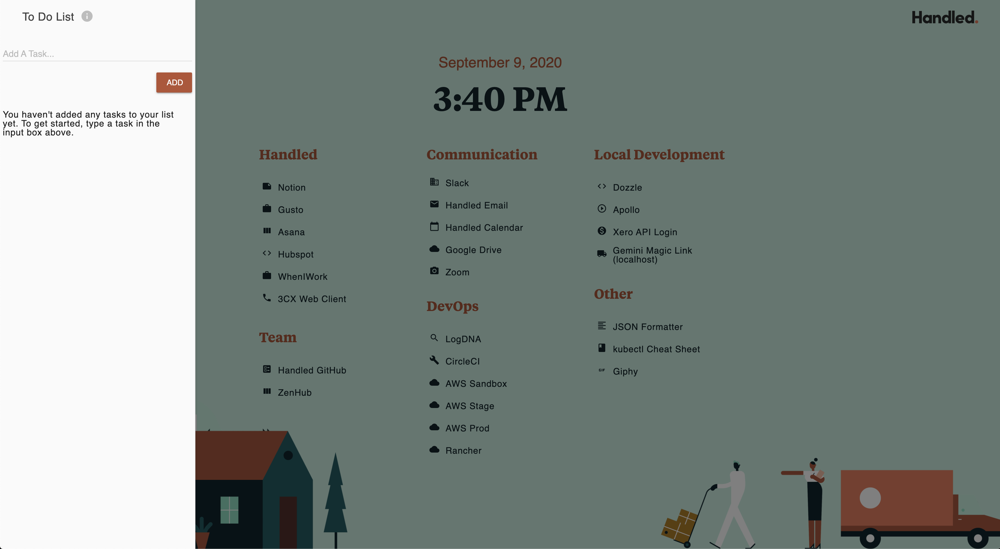

Introduction
------
This is a Google Chrome extension that overrides the default New Tab behavior. This provides access to important Handled links, and can also be customized to your team and personal needs simply by altering the `index.html` content.

In order to use this Chrome Extension, download or clone this repo.

Then in Chrome, open the Extensions page by clicking on the Chrome menu, selecting `More Tools`, and click on `Extensions`.


In the upper right corner of the screen, there is a toggle for `Developer Mode`. Enable `Developer Mode` if it is not already enabled.


Click the `Load Unpacked` option and open the directory that contains the `Handled Start Page` project that you downloaded/cloned.


You will see the new Extension loaded on the `Extensions` page, and when you open a new tab, you will now see the Handled Start Page.


To Do List
------
Click the icon in the upper left corner to open the sidebar menu. Contained here is a to do list. The to do list uses your browsers local storage to store your list.



To begin, add a task with the input box, and you will see it displayed just below the input box.

To mark a task as complete, simply click on it.

To delete tasks from your list, hover over the item to reveal a trash can icon to the right, which will delete the task once clicked.

Customization
------
 To customize the `Team` section of this page, open `index.html` and find the following snippet:
 ```html
 <div class="mdl-cell mdl-cell--4-col cell"><!-- Start of 2nd column of links -->
   <h4 class="mdl-color-text--primary">Team</h4>
   <ul class="link-list-item mdl-list">
      <li class="mdl-list__item">
        <i class="material-icons mdl-list__item-icon md-18 md-dark">ballot</i>
        <a href="https://github.com/handled">Handled GitHub</a>
      </li>
      <li class="mdl-list__item">
        <i class="material-icons mdl-list__item-icon md-18 md-dark">view_column</i>
        <a href="https://app.zenhub.com/">ZenHub</a>
      </li>
   </ul>
 </div><!-- End of 2nd column of links -->
 ```
 Each list item (`<li>`) element is a link (`<a>`) with an icon (`<i>`) positioned to the left. To add additional links, add a complete `<li>` element to the unordered list (`<ul>`) above:
 ```html
 <li class="mdl-list__item">
   <i class="material-icons mdl-list__item-icon md-18 dark">code</i><!-- Material Design Icon Name from https://material.io/tools/icons/?style=baseline -->
   <a href="link goes here">Link Title Goes Here</a>
 </li>
 ```

If you choose to customize the links for your team or personal needs, you may wish to change the icons associated to each link. This project uses the [Material Design Icon](https://material.io/tools/icons/?style=baseline) set with a number of different choices to choose from.

If you would like to customize the look and feel of this project even further, feel free to review the documentation for the [Material Design Lite Framework](https://getmdl.io/components/index.html) which was used to create this project.
